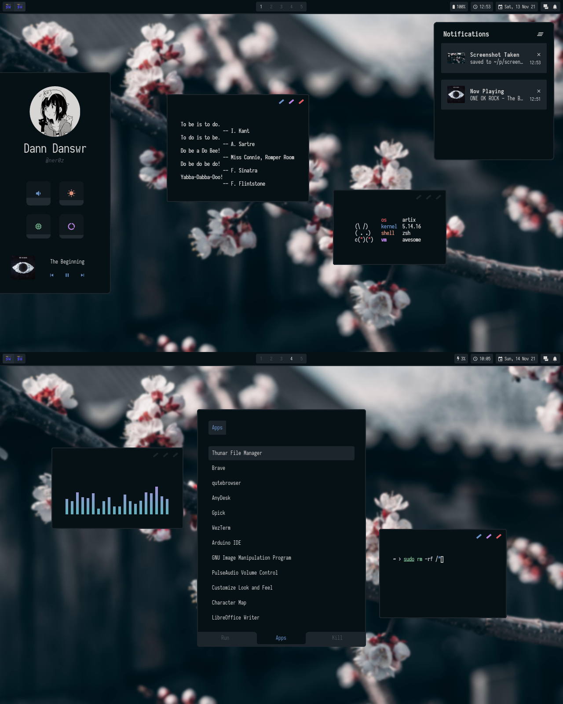

<h1 align="center">.files</h1>

<i>ricing tross.. kerjanya kapan</i>

 

<b>*Note: these dotfiles are configured on my 1280x800 laptop screen, which means 16:10. So if you're using a standard 16:9 screen resolution, you'll have to change some config to make these dotfiles fit well on your screen.</b>

### Programs
- Window Manager: awesome-git
- Compositor: [picom (ibhagwan fork)](https://github.com/ibhagwan/picom)
- Terminal: wezterm
- Editor: neovim + [nvchad](https://github.com/NvChad/NvChad)
- Browser: qutebrowser
- Launcher: rofi

### Some sht

### Thanks to
- [javacafe01](https://github.com/JavaCafe01)
- [owl4ce](https://github.com/owl4ce)
